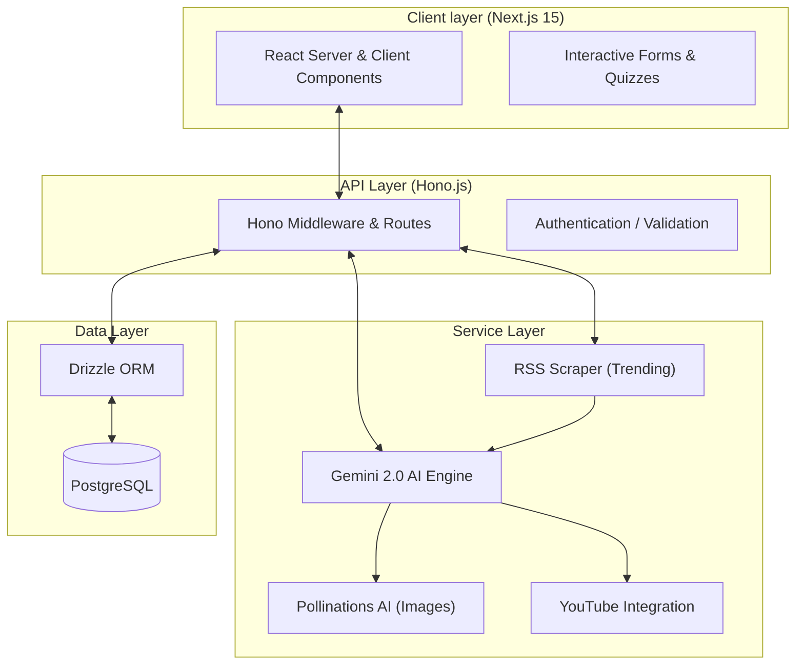

# 🌿 Knowledge Portal — AI-Powered Website Blueprint

> A comprehensive guide to features, functionality, design system, and AI integrations for a modern localized knowledge, cultural, and global intelligence platform.

---

## 🎯 Project Overview

The **Knowledge Portal** is a streamlined AI-powered hub designed to empower communities through localized intelligence and cultural preservation. 

> "Your gateway to cultural knowledge and AI-powered insights — exploring languages, traditions, and ideas that the world's mainstream platforms overlook."

The platform has been refactored into a focused dual-purpose architecture:

1. **Cultural Exploration & Preservation** — Safeguarding localized traditions, language variants, and historical knowledge. (Route: `/explore`)
2. **AI-Driven Global Intelligence** — Providing deep, research-backed insights across critical sectors (Agriculture, Health, Education, Sports, Politics) through an automated AI blog engine. (Route: `/blogs`)

The portal serves as a bridge between traditional wisdom and modern AI capabilities, ensuring that vital information is accessible, accurate, and interactive.

---

## 🎨 Design System

### Color Palette

| Role | Color Name | Hex | Usage |
|------|-----------|-----|-------|
| Primary | Deep Mahogany | `#6B1E14` | Headers, CTAs, primary branding |
| Secondary | Saffron Gold | `#E8A020` | Accents, highlights, icons |
| Tertiary | Tropical Green | `#2D6A4F` | Links, success states, Agriculture category |
| Background | Warm Ivory | `#FAF6EF` | Global page background |
| Surface | Creamy White | `#FFF9F0` | Cards, glassmorphism panels |
| Dark | Rich Espresso | `#1A0A05` | Primary text, footer backgrounds |
| Muted | Sandstone | `#C4A882` | Borders, subtle metadata |
| Accent | Caribbean Teal | `#1B7A7A` | Info states, specialized actions |

### Typography

| Use | Font | Weight | Notes |
|-----|------|--------|-------|
| Headlines | **Playfair Display** | 700–900 | Elegant serif for cultural headlines |
| Body Text | **Lora** | 400–600 | Warm, readable serif for long-form blogs |
| UI Elements | **DM Sans** | 400–500 | Clean sans for navigation and forms |

---

## 🏗️ Website Structure

### 1. Home Page (`/`)
- **Hero Section**: High-impact branding with the "Knowledge Portal" identity.
- **Mission Statement**: Focused on preserving localized knowledge and empowering communities via AI.
- **Latest Insights**: A curated grid of the newest AI-generated blog posts.
- **Section Redirects**: Direct entry points to **Explore Culture** and **AI Blogs**.

### 2. Culture Explorer (`/explore`)
- **Smart Dictionary**: Universal translation engine between 50+ languages and Creole variants (`/explore/dictionary`).
- **AI Assistant "Koné"**: Conversational agent specializing in cultural history and language guidance (`/explore/assistant`).
- **Learning Tools**: Dynamic flashcard generation and AI grammar correction (`/explore/learning`).

### 3. AI Insights Blog Engine (`/blogs`)
- **Curated Feed**: Displays the latest research across all categories (Agriculture, Health, Education, Sports, Politics).
- **Automated Generator**: A sophisticated AI engine that "scrapes" regional and sector-specific trending news (via RSS) to identify high-impact topics.
- **Expert Personas**: Articles are written using specialized expert personas (e.g., Agricultural Scientist, Clinical Researcher) to ensure authoritative, evidence-based content.
- **Deep Research Generation**: High-fidelity, 1,200+ word articles featuring structured HTML, data points, and expert insights via Gemini 2.0 Flash.
- **Multimedia Integration**: Every blog is enhanced with context-aware **YouTube coverage** and photorealistic **Pollinations AI** cover images.
- **Interactive Knowledge Check**: Built-in 5-question AI-generated quizzes with immediate feedback to reinforce reader comprehension.
- **Full archive access**: Complete listing of all previously generated intelligence reports.

---

## 🤖 AI & Technical Stack

### AI Integrations (Google Gemini 2.0 Flash)
- **Deep Research Persona**: Gemini acts as a professional analyst, cross-referencing trending news with high-quality knowledge bases.
- **Interactive Quiz Engine**: Automated generation of 5-question multiple-choice tests for every article.
- **Multilingual Lexicography**: AI-powered dictionary providing definitions, phonetics, and cultural context.
- **Visual Synthesis**: Dynamic cover image generation via Pollinations AI integration.

### Core Technology
- **Framework**: Next.js 15 (App Router)
- **Database**: PostgreSQL with Drizzle ORM
- **Styling**: Tailwind CSS
- **API Architecture**: Hono.js integrated into Next.js routes
- **Content Source**: Category-specific RSS feeds (Trending.ts)

---

## 🏗️ Technical Architecture

The Knowledge Portal follows a modern decoupled architecture where the frontend, backend, and AI layers interact seamlessly:

### Data Flow & Lifecycle:

1. **Trend Discovery**: The `RSS Scraper` fetches global news which is analyzed by `Gemini` to identify high-relevance topics.
2. **Blog Synthesis**: Gemini assumes an `Expert Persona` to generate a 1,200+ word report. The result is structured as JSON, including a dynamic **Pollinations AI** image prompt and **YouTube** video search parameters.
3. **Persistence**: The structured report and generated quiz are saved to `PostgreSQL` via `Drizzle`.
4. **Delivery**: The `Next.js` frontend fetches data through `Hono` API routes and renders interactive, SEO-optimized pages.

---

## 📋 Current Implementation Status

- [x] Full rebranding from legacy "Creole" to **Knowledge Portal**.
- [x] **AI Blog Engine**: RSS-based discovery and Gemini 2.0 article writing.
- [x] **Smart Dictionary**: Multilingual translation engine with 50+ world languages.
- [x] **AI Assistant "Koné"**: Warm, culturally grounded conversational agent.
- [x] **Learning & Grammar Tools**: Flashcard generation and professional proofreading.
- [x] **Interactive Quizzes**: Real-time feedback UI for knowledge retention.
- [x] **Global Search**: Unified search available in the site header.
- [x] **Footer Redesign**: Streamlined professional footer with quick navigation.

### ⏳ In Progress (Phase 3)
- [ ] **Advanced Learning Center**: Transitioning static courses to interactive AI-tutor sessions.
- [ ] **Global Search**: Unified indexing across the dictionary and the growing blog archive.
- [ ] **Offline PWA Support**: Enabling cached access to core health and agriculture guides.

---

## 🌍 Sector Specializations

| Sector | Focus Area | AI Integration |
|--------|------------|----------------|
| **Agriculture** | Soil health, sustainable yield, and pest management. | RSS Trend Tracking + Gemini Pro tips. |
| **Health** | Clinical accuracy, disease prevention, and well-being. | Strict disclaimer enforcement + accuracy-first prompts. |
| **Education** | Bilingual curriculum and instructional clarity. | Lesson-plan style structures in blog content. |
| **Sports** | Global events and community fitness trends. | Real-time news synthesis. |
| **Politics** | Policy analysis and civic engagement. | Neutral, analytical reporting. |

---

*Built with love to preserve localized knowledge and empower communities to solve real challenges.*

*"Yon sèl dwèt pa ka manje kalalou." — One finger cannot eat okra alone. (Haitian Proverb)*